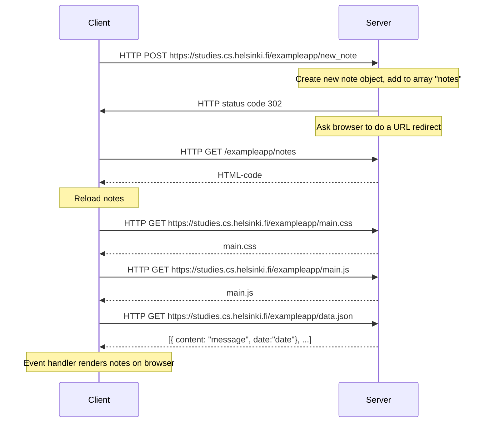

```mermaid
sequenceDiagram
    participant A as Client
    participant B as Server
    A->>B: HTTP POST https#58;//studies.cs.helsinki.fi/exampleapp/new_note
    Note over B: Create new note object, add to array "notes"
    B->>A: HTTP status code 302
    Note over B: Ask browser to do a URL redirect
    A->>B: HTTP GET /exampleapp/notes
    B-->>A: HTML-code
    Note over A: Reload notes
    A->>B: HTTP GET https#58;//studies.cs.helsinki.fi/exampleapp/main.css
    B-->>A: main.css
    A->>B: HTTP GET https#58;//studies.cs.helsinki.fi/exampleapp/main.js
    B-->>A: main.js
    A->>B: HTTP GET https#58;//studies.cs.helsinki.fi/exampleapp/data.json
    B-->>A: [{ content#58; "message", date#58;"date"}, ...]
    Note over A: Event handler renders notes on browser
```