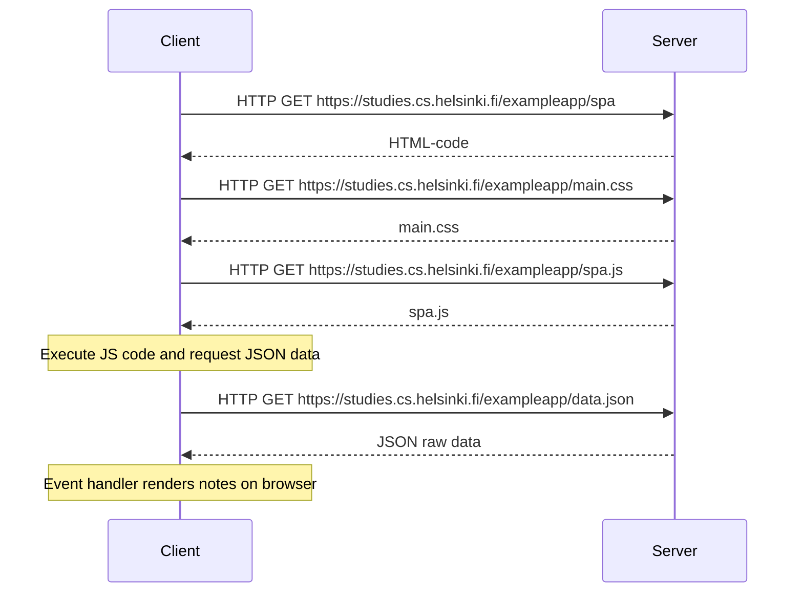

```mermaid
sequenceDiagram
    participant A as Client
    participant B as Server
    A->>B: HTTP GET https#58;//studies.cs.helsinki.fi/exampleapp/spa
    B-->>A: HTML-code
    A->>B: HTTP GET https#58;//studies.cs.helsinki.fi/exampleapp/main.css
    B-->>A: main.css
    A->>B: HTTP GET https#58;//studies.cs.helsinki.fi/exampleapp/spa.js
    B-->>A: spa.js
    Note over A: Execute JS code and request JSON data
    A->>B: HTTP GET https#58;//studies.cs.helsinki.fi/exampleapp/data.json
    B-->>A: JSON raw data
    Note over A: Event handler renders notes on browser
```