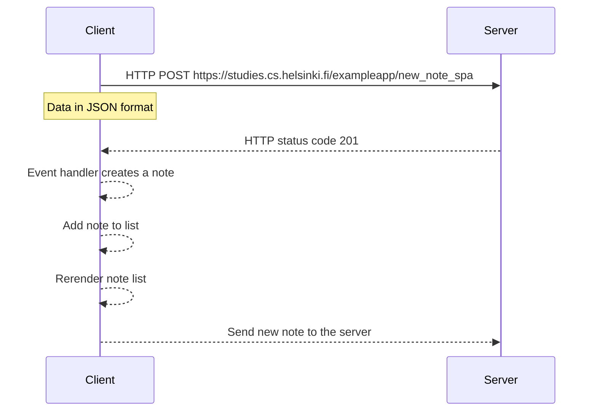

```mermaid
sequenceDiagram
    participant A as Client
    participant B as Server
    A->>B: HTTP POST https#58;//studies.cs.helsinki.fi/exampleapp/new_note_spa
    Note over A: Data in JSON format
    B-->>A: HTTP status code 201
    A-->>A: Event handler creates a note
    A-->>A: Add note to list
    A-->>A: Rerender note list
    A-->>B: Send new note to the server
```